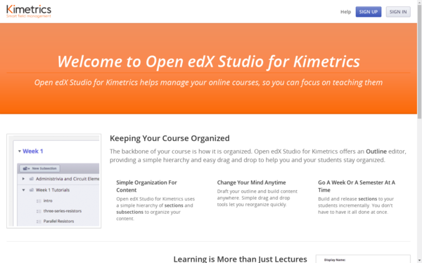

.. _edx-cms-label:

edX Courses Managment System
============================

La plataforma edX dispone un **Courses Managment System**, como se presenta a continuación:

Iniciar el servicio de Supervisor, ejecutando el siguiente comando:

.. code-block:: bash

    $ sudo /edx/app/supervisor/venvs/supervisor/bin/supervisord -n -c /edx/app/supervisor/supervisord.conf

Acceder a consola administrativa de Supervisor

.. code-block:: bash

    $ sudo /edx/app/supervisor/venvs/supervisor/bin/supervisorctl -c /edx/app/supervisor/supervisord.conf

Ver que procesos se ejecutan desde la consola de comando administrativa, ejecute:

.. code-block:: bash

    supervisor> status
	edxapp:cms        RUNNING   pid 17000, uptime 1:50:45
	edxapp:lms        RUNNING   pid 27391, uptime 0:24:32
	forum             FATAL     Exited too quickly (process log may have details)

Detener aplicación CMS, con el siguiente comando:

.. code-block:: bash

    supervisor> stop edxapp:cms
    edxapp:cms: stopped

Ver que procesos se ejecutan desde la consola de comando administrativa, ejecute:

.. code-block:: bash

    supervisor> status
	edxapp:cms        STOPPED   Mar 27 05:08 PM
	edxapp:lms        STOPPED   Mar 27 05:09 PM
	forum             FATAL     Exited too quickly (process log may have details)
	supervisor> 

Iniciar aplicación CMS, con el siguiente comando:

.. code-block:: bash

    supervisor> start edxapp:cms
	edxapp:cms: started

Ver que procesos se ejecutan desde la consola de comando administrativa, ejecute:

.. code-block:: bash

    supervisor> status
	edxapp:cms        RUNNING   pid 30487, uptime 0:00:37
	edxapp:lms        RUNNING   pid 30561, uptime 0:00:07
	forum             FATAL     Exited too quickly (process log may have details)
	supervisor> 

Mostrar el archivo de registro de error de la aplicación CMS, con el siguiente comando:

.. code-block:: bash

    supervisor> tail -10000 edxapp:cms stderr

Mostrar el archivo de registro de acceso de la aplicación CMS, con el siguiente comando:

.. code-block:: bash

    supervisor> tail -10000 edxapp:cms stdout

Mostrar el archivo de registro de error de la aplicación CMS, con el siguiente comando:

.. code-block:: bash

    tail -f /edx/var/log/supervisor/cmstderr.log

Mostrar el archivo de registro de acceso de la aplicación CMS, con el siguiente comando:

.. code-block:: bash

    tail -f /edx/var/log/supervisor/cmstdout.log

.. code-block:: cfg

    $ sudo /edx/app/supervisor/venvs/supervisor/bin/supervisorctl -c /edx/app/supervisor/supervisord.conf status edxapp:cms

Configuración de supervisor para la aplicación CMS:

.. code-block:: cfg

    $ cat /edx/etc/conf.d/cms.conf

.. code-block:: cfg

	[program:cms]

	command=/edx/app/edxapp/venvs/edxapp/bin/gunicorn  --preload -b 127.0.0.1:8010 -w 2 --timeout=300 --pythonpath=/edx/app/edxapp/edx-platform cms.wsgi
	user=www-data
	directory=/edx/app/edxapp/edx-platform
	environment=PORT=8010,ADDRESS=127.0.0.1,LANG=en_US.UTF-8,DJANGO_SETTINGS_MODULE=cms.envs.docker,SERVICE_VARIANT="cms"
	stdout_logfile=/edx/var/log/supervisor/%(program_name)-stdout.log
	stderr_logfile=/edx/var/log/supervisor/%(program_name)-stderr.log
	killasgroup=true
	stopasgroup=true
