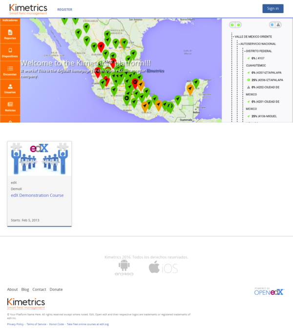

.. _edx-lms-label:

edX Learning Managment System 
=============================

La plataforma edX dispone un **Learning Managment System**, como se presenta a continuación:

Iniciar el servicio de Supervisor, ejecutando el siguiente comando:

.. code-block:: bash

    $ sudo /edx/app/supervisor/venvs/supervisor/bin/supervisord -c /edx/app/supervisor/supervisord.conf

Acceder a consola administrativa de Supervisor, ejecutando el siguiente comando:

.. code-block:: bash

    $ sudo /edx/app/supervisor/venvs/supervisor/bin/supervisorctl -c /edx/app/supervisor/supervisord.conf

Ver que procesos se ejecutan desde la consola de comando administrativa, ejecute:

.. code-block:: bash

    supervisor> status
	edxapp:cms        RUNNING   pid 17000, uptime 1:50:45
	edxapp:lms        RUNNING   pid 27391, uptime 0:24:32
	forum             FATAL     Exited too quickly (process log may have details)

Detener aplicación LMS, con el siguiente comando:

.. code-block:: bash

    supervisor> stop edxapp:lms
	edxapp:lms: stopped

Ver que procesos se ejecutan desde la consola de comando administrativa, ejecute:

.. code-block:: bash

    supervisor> status
	edxapp:cms        STOPPED   Mar 27 05:08 PM
	edxapp:lms        STOPPED   Mar 27 05:09 PM
	forum             FATAL     Exited too quickly (process log may have details)
	supervisor> 

Iniciar aplicación LMS, con el siguiente comando:

.. code-block:: bash

    supervisor> start edxapp:lms
	edxapp:lms: started

Ver que procesos se ejecutan desde la consola de comando administrativa, ejecute:

.. code-block:: bash

    supervisor> status
	edxapp:cms        RUNNING   pid 30487, uptime 0:00:37
	edxapp:lms        RUNNING   pid 30561, uptime 0:00:07
	forum             FATAL     Exited too quickly (process log may have details)
	supervisor> 

Mostrar el archivo de registro de error de la aplicación LMS, con el siguiente comando:

.. code-block:: bash

    supervisor> tail -10000 edxapp:lms stderr

Mostrar el archivo de registro de acceso de la aplicación LMS, con el siguiente comando:

.. code-block:: bash

    supervisor> tail -10000 edxapp:lms stdout

Mostrar el archivo de registro de error de la aplicación LMS, con el siguiente comando:

.. code-block:: bash

    tail -f /edx/var/log/supervisor/lmstderr.log

Mostrar el archivo de registro de error de la aplicación LMS, con el siguiente comando:

.. code-block:: bash

    tail -f /edx/var/log/supervisor/lmstdout.log

.. code-block:: bash

    $ sudo /edx/app/supervisor/venvs/supervisor/bin/supervisorctl -c /edx/app/supervisor/supervisord.conf status edxapp:lms

Configuración de supervisor para la aplicación LMS, se describe a continuación:

.. code-block:: cfg

    [program:lms]

	command=/edx/app/edxapp/venvs/edxapp/bin/gunicorn  --preload -b 127.0.0.1:8000 -w 2 --timeout=300 --pythonpath=/edx/app/edxapp/edx-platform lms.wsgi

	user=www-data
	directory=/edx/app/edxapp/edx-platform
	environment=PORT=8000,ADDRESS=127.0.0.1,LANG=en_US.UTF-8,DJANGO_SETTINGS_MODULE=lms.envs.docker,SERVICE_VARIANT="lms",PATH="/edx/app/edxapp/venvs/edxapp/bin:/edx/app/edxapp/edx-platform/bin:/edx/app/edxapp/.rbenv/bin:/edx/app/edxapp/.rbenv/shims:/edx/app/edxapp/.gem/bin:/edx/app/edxapp/edx-platform/node_modules/.bin:/usr/local/sbin:/usr/local/bin:/usr/sbin:/usr/bin:/sbin:/bin"
	stdout_logfile=/edx/var/log/supervisor/%(program_name)-stdout.log
	stderr_logfile=/edx/var/log/supervisor/%(program_name)-stderr.log
	killasgroup=true
	stopasgroup=true
