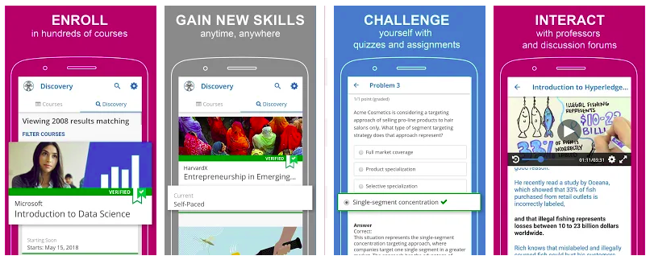

.. _soporte-movil-label:

Soporte a Móvil
===============

La plataforma soporta acceso desde una aplicación móvil para `Android <https://play.google.com/>`_

Para descarga su aplicación móvil edX esta disponible para:

- Para Android `org.edx.mobile <https://play.google.com/store/apps/details?id=org.edx.mobile&hl=es>`_.

Configuración de acceso
-----------------------

A tu archivo de configuración ``/edx/app/edxapp/lms.env.json`` agrega las siguientes diferencias:

.. code-block:: bash

    @@ -75,18 +75,21 @@
         "EMAIL_BACKEND": "django.core.mail.backends.smtp.EmailBackend",
         "EMAIL_HOST": "smtp.sendgrid.net",
         "EMAIL_PORT": 587,
         "EMAIL_USE_TLS": false, 
         "FEATURES": {
             "AUTH_USE_OPENID_PROVIDER": true,
             "AUTOMATIC_AUTH_FOR_TESTING": false,
             "CERTIFICATES_ENABLED": true,
             "ENABLE_DISCUSSION_SERVICE": true,
             "ENABLE_INSTRUCTOR_ANALYTICS": true,
             "ENABLE_S3_GRADE_DOWNLOADS": true,
             "ENABLE_THIRD_PARTY_AUTH": false,
    +        "ENABLE_MOBILE_REST_API": true,
    +        "ENABLE_OAUTH2_PROVIDER": true,
    +        "ENABLE_COMBINED_LOGIN_REGISTRATION": true,
             "PREVIEW_LMS_BASE": "",
             "SUBDOMAIN_BRANDING": false,
             "SUBDOMAIN_COURSE_LISTINGS": false,
             "USE_CUSTOM_THEME": false
         },
         "FEEDBACK_SUBMISSION_EMAIL": "",
    @@ -111,6 +114,8 @@
         "MICROSITE_ROOT_DIR": "/edx/app/edxapp/edx-microsite",
         "MKTG_URLS": {},
         "MKTG_URL_LINK_MAP": {},
    +    "OAUTH_ENFORCE_SECURE": true,
    +    "OAUTH_OIDC_ISSUER": "http://127.0.0.1:8000/oauth2",
         "ORA2_FILE_PREFIX": "default_env-default_deployment/ora2",
         "PAID_COURSE_REGISTRATION_CURRENCY": [
             "usd",
    @@ -121,8 +126,8 @@

Reinicie el servicio del CMS.

Referencia
----------

- `The edX mobile app for Android and iPhone <https://open.edx.org/features/edx-mobile-app-android-and-iphone>`_.
- `Overview of the edX Mobile App <http://edx-guide-for-students.readthedocs.io/en/latest/SFD_mobile.html#overview-of-the-edx-mobile-app>`_.
- `edX - Online Courses by Harvard, MIT, & more apk <https://www.apkmonk.com/app/org.edx.mobile/>`_.
